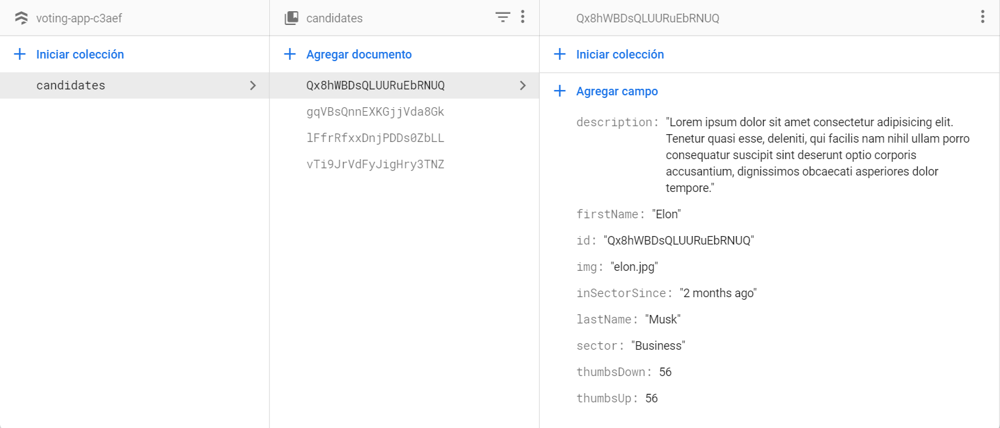

# UI Test Zemoga

Zemoga test for frontend role. this application consist in two parts, the first part is in the branch *layout*, in this branch we have the interactive parte where we can submit votes for the candidates.

## Technologies

This project was generated with [Angular CLI](https://github.com/angular/angular-cli) version 11.1.0. For the styles the project compiles **SCSS** files.

## Development server

- Run `npm install`

- Run `ng serve` for a dev server. Navigate to `http://localhost:4200/`. The app will automatically reload if you change any of the source files.

## Overview

In this branch we have all the logic to vote for a candidates in the grid, all the data is stored in a Firebase Database.

## Arquitecture

This project is made-up with a UI that gets the information from a database hosted in Google Firebase.

### Model

```json
{
    "id": string,
    "firstName": string,
    "lastName": string,
    "inSectorSince": string,
    "sector": string,
    "description": string,
    "thumbsUp": number,
    "thumbsDown": number,
    "img": string
}
```

### Firebase Collection


